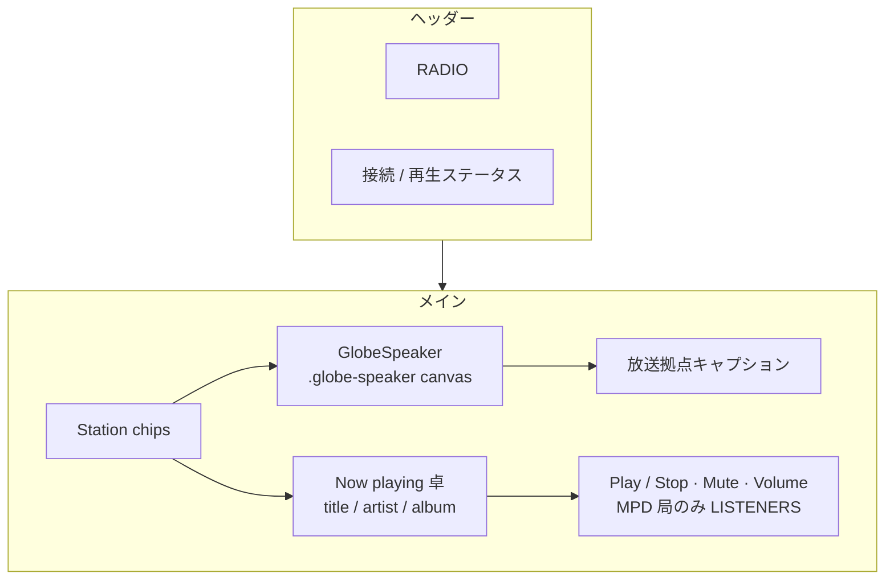

# Home UI デザイン仕様

> 本書はリスナー向け Home の見た目、操作、アクセシビリティ契約の正本です。システム責務とデータフローは [docs/architecture.md](docs/architecture.md)、認証は [docs/security.md](docs/security.md) を参照してください。トークン値の正本は [`style.css`](workers/app/style.css)。形式は [DESIGN.md 仕様](https://github.com/google-labs-code/design.md) に沿う。

Home はコンシューマー向けの音楽アプリではなく、**放送卓**です。UI は後退し、地球儀と now-playing だけが光ります。ミントは装飾ではなく、再生できることの印です。

## Overview（ビジュアルテーマ）

深いネイビーの劇場。アイボリーの本文。IBM Plex Sans のニュースルーム。地球儀がアルバムアート相当の主役で、カードは操作卓です。

- 奥行きは **トーナルレイヤー**（`base-100` → `base-200` → hairline）で表現し、ドロップシャドウは使わない。
- 再生状態の radial wash は画面上部に薄いヴェールとして載せ、地球儀のグローと競合させない。
- 禁止事項の一覧は [Do's and Don'ts](#dos-and-donts) を参照。

## Colors（カラー）

`radio` daisyUI theme（[`style.css`](workers/app/style.css)）。値はテーマ変数が正本。役割だけをここに固定する。

| トークン | 役割 |
|---|---|
| `base-100` | 劇場の床 |
| `base-200` | now-playing 卓 |
| `base-300` | hairline |
| `base-content` | 本文・曲名 |
| `base-content/70` | 補助文 |
| `base-content/55` | キャプション・座標 |
| `primary` | Play、選択マーカー、LIVE |
| `warning` | CONNECTING |
| `error` | UNAVAILABLE / stream error |
| `neutral` | READY / MUTED |

状態ごとの wash:

| 状態 | wash |
|---|---|
| LIVE | mint 約 14% |
| CONNECTING | warning 約 12% |
| UNAVAILABLE | error 約 12% |
| それ以外 | mint 約 8% |

GlobeSpeaker の glow / marker RGB はこれらの semantic 色に揃える。カタログの他局は dim marker。

## Typography（タイポグラフィ）

IBM Plex Sans。座標と listener count だけ `font-mono` + tabular nums。

| 役割 | 指定 |
|---|---|
| ブランド | 11–14px, semibold, tracking `0.28em`, `primary` |
| eyebrow | 11px, uppercase, tracking `0.22em`, `base-content/55` |
| 曲名 | 24–36px, semibold, tracking-tight, `base-content` |
| アーティスト | 16–18px, `base-content/85` |
| アルバム / 局名 | 14px, `base-content/55` |
| 拠点名 | 16–18px, medium |
| 座標 | 12px mono, `base-content/55` |
| 操作ラベル | sentence case |

## Layout（Home レイアウト）

- **モバイル（幅 768px 未満）**: Tune in、globe、now-playing、controls、MPD listener count を縦に置く。Tune in chip 列のみ `snap-x` 横スクロール可。Play / Mute / Volume は常に viewport 内（clipping なし）。ページ全体の横スクロールは禁止。viewport 高さを超えたら縦スクロールを許可する。
- **デスクトップ（幅 768px 以上）**: globe と拠点キャプションを左、now-playing 卓を右。卓を引き伸ばさない。
- コンテンツ幅: `max-w-6xl`。デスクトップでは地球儀が伸び、卓は `minmax(20rem, 24rem)` で densify する。
- 余白: ヘッダー `px-4 sm:px-8`、セクション間 `gap-6 md:gap-12`。
- 地球儀グローがレイアウト幅を押し広げないよう、Home シェルは `overflow-x-hidden`。
- スピーカーは `GlobeSpeaker`（cobe 3D）。安定した `.globe-speaker` canvas クラスを持つ。局選択で**都市レベルの放送拠点**（配信サーバーや番組スタジオではない）の都市名・座標を出し、選択中の拠点をアクセシブルに識別する。

## Elevation & Depth（奥行き）

フラットな放送卓。階層は **色の段** と **hairline** で示し、カードの浮き上がりやドロップシャドウは使わない。

- 床 `base-100`、卓 `base-200`、区切り `base-300` の 3 段だけ。`style.css` の `--depth: 0` / `--noise: 0` が正本。
- 区切りは 1px hairline（`border-base-300/70` 等）。コントラストで読み取り順を作る。
- 状態の radial wash（mint / warning / error）は **背景の大気** であり、要素の elevation ではない。
- GlobeSpeaker の `blur-3xl` glow も舞台照明。z-index スタックや shadow で UI を重ねない。
- 禁止: 重いドロップシャドウ、彩度のある「浮きカード」、badge の膨らませ装飾（[Do's and Don'ts](#dos-and-donts) も参照）。

## Shapes（形状）

角丸とタッチ領域。半径トークンは `style.css`（`--radius-selector` / `--radius-field` / `--radius-box`）が正本。

- フィールド（chip / Play / Mute）: `rounded-full`（pill）
- 卓（now-playing）: `rounded-box`
- タッチターゲット: 最小 44×44 CSS px（`min-h-11` / `min-h-12`）
- 操作ラベルは sentence case。箱ものと操作系の形の対比を崩さない。

## Components（コンポーネント）

### ヘッダー

左に RADIO ident（ミントのドット + トラッキング）。右に status。ghost の小さなステータスチップ。下に `base-300` の hairline。

### Tune in

chip の radiogroup。選択中は mint の hairline と文字色。他は ghost。切り替えると caption、選択 marker、放送アークを同時に更新し、地球儀はその拠点へ向く。ポインタ drag で一時的に回せ、離すと選択拠点へ戻す。LIVE 中は bass onset から推定した BPM で地球儀が回り、停止後は選択拠点へ戻る。`prefers-reduced-motion: reduce` では drag オフセットを即時リセットする。

### GlobeSpeaker

ネイビーの地球。選択局はミント marker、他局は dim。東京ハブからの放送アーク。`CONNECTING` / `UNAVAILABLE` は warning / error。軌道リングは `base-content` の hairline。

### Now playing

hairline の `base-200` 卓。eyebrow は「On the station」または「Live radio」。曲名が最大の文字。アーティストは本文色。Instrumental は outline badge。track metadata を持たない外部局は局名のみ。

### 再生コントロール

Play は `btn-primary`。Stop も同じボタン。Mute は ghost。Volume は `range`（primary track は信号、CTA ではない）。Play / Mute は `min-h-12`。MPD 局だけ `LISTENERS` を tabular nums で出す。

## 再生・音声反応

- local playback が audible、unmuted、buffering なしのとき、globe brightness と marker size は MPD state や listener count ではなく測定した audio level と bass に反応する。yaw は bass onset 間隔から推定した BPM で回り、推定できないときは 96 BPM を使う。
- 停止、ミュート、volume zero では反応が減衰し、回転は選択拠点へ戻り、その後 repeated drawing を停止する。
- connecting / buffering 中は `LIVE` ではなく **CONNECTING**。地球儀は warning。待ちをキャンセルできる **Stop** を残す。
- local stream 失敗は error color と textual error。
- `LIVE` はローカルで音声を再生できている状態。MPD メタデータ購読は Play 後。

## Now playing と listener count

- SSR 初回は非負整数。取得不能でも `0` または明示的な unavailable。ページは壊さない。
- MpdAgent が接続中に `listeners` の変化を検出したら、full page reload なしで current-song と同じ Agents SDK state push から更新する。
- 表示中の listener count は live region または status role で polite に通知する。

## 既存動作の保持

Play は configured stream URL に接続し、Stop は停止する。MPD 局の title / artist / album は既存の MpdAgent watch path。

## Do's and Don'ts

### Do

- `primary`（ミント）は **Play**、選択局マーカー、LIVE 表示だけに使う
- サーフェスは `base-*` の段階だけ。カードは hairline と低いコントラスト
- 操作系は pill、卓は `rounded-box`。操作ラベルは sentence case
- 地球儀はハイドレーション後 **1 つ**の canvas。局切替で globe / audio graph を再生成しない
- カタログの他局は dim marker。選択局だけ mint marker
- LIVE 中のみ bass onset から推定した BPM で地球儀を回し、停止・ミュート後は選択拠点へ戻す
- `prefers-reduced-motion: reduce` では装飾 drift と BPM 回転を止め、局と playback state は出し続ける
- listener count は live region または status role で polite に通知する
- track metadata がない外部局は局名だけ出す

### Don't

- `primary` をラベル・キャプション・軌道リングなど装飾に使わない
- チップや Mute に塗りつぶし primary を使わない（**Play だけ**）
- 彩度のある面、重いドロップシャドウ、`badge` の膨らませ装飾を使わない
- ページ全体の横スクロールや primary controls（Play / Mute / Volume）の clipping を許さない（Tune in chip 列の `snap-x` は [Layout](#layouthome-レイアウト) のとおり可）。デスクトップで now-playing 卓を引き伸ばさない
- 存在しない曲情報を捏造しない。外部局で MPD listener count を出さない
- ホバーで音声を取得しない。metadata-only の agent error を再生失敗扱いにしない
- live audio、current-song metadata、play/stop の既存挙動を退行させない

## 実装の入口

- テーマトークン（`radio` daisyUI theme）: [`style.css`](workers/app/style.css)
- レイアウト: [`Home.tsx`](workers/app/pages/Home.tsx)
- 地球儀と局カタログ: [`GlobeSpeaker.tsx`](workers/app/components/GlobeSpeaker.tsx)、[`stations.ts`](workers/app/lib/radio/stations.ts)、[`globe-view.ts`](workers/app/lib/radio/globe-view.ts)
- 音声反応（96 BPM / 16 beats）: [`audio-reactivity.ts`](workers/app/lib/radio/audio-reactivity.ts)
- 音声再生と MPD 同期: [`use-radio-player.tsx`](workers/app/lib/radio/use-radio-player.tsx)、[`use-mpd-agent.tsx`](workers/app/lib/radio/use-mpd-agent.tsx)
