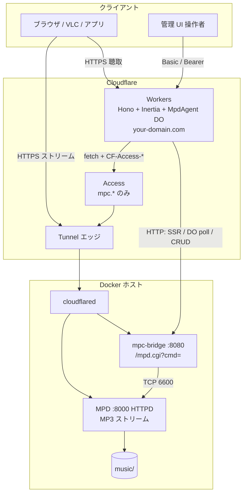
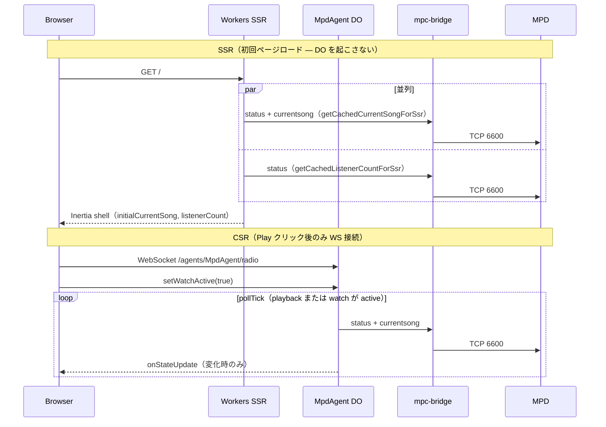

# アーキテクチャ仕様

> 本書はシステムの責務、構成、データフロー、データモデルの正本です。画面の見た目・操作契約は [DESIGN.md](../DESIGN.md)、技術選定と ADR は [tech.md](tech.md)、認証境界は [security.md](security.md) を参照してください。

<a id="system-topology"></a>
## システムトポロジ



**制御の原則**: ブラウザは MPD TCP に直接触れません。ポーリングとライブ push は **MpdAgent DO 1 本**、キュー CRUD は Workers → mpc-bridge → MPD です。認証経路の詳細は [security.md#auth-matrix](security.md#auth-matrix) を参照してください。

## 原則と責務

- **最小構成主義**: Alpine Linux + 公式パッケージのみ。不要なレイヤーを排除し、イメージサイズと攻撃対象を最小化します。
- **コンテナ単一責任**: MPD は再生・ストリーム、mpc-bridge はプロトコル変換、Tunnel は公開、Web UI は Cloudflare Workers が担当します。
- **設定の読み取り専用化**: `config/mpd.conf` と `config/config` は `:ro` マウントし、音楽ディレクトリは永続ボリュームとして扱います。
- **ローカル制御ポートの分離**: 6600 ポートはコンテナ内ネットワークでのみ公開し、ホストへは既定で公開しません。

### モジュール責務

| モジュール | 責任 | インターフェース |
|---|---|---|
| `Dockerfile` | Alpine 3.20 上の MPD/mpc/ncmpcpp 実行環境 | MPD 6600（制御）、8000（ストリーム）、8001（リスナー数） |
| `compose.yaml` | MPD、mpc-bridge、Tunnel、ボリュームのスタック | `docker compose up` |
| `mpc-bridge/` | MPD テキストプロトコルを HTTP に変換、TCP 接続をプール | `GET /mpd.cgi?cmd=...` |
| `config/mpd.conf` | 音楽ディレクトリ、出力形式、自動更新など MPD 動作 | `/etc/mpd.conf` としてマウント |
| `Makefile` / `scripts/test.sh` | 高頻度操作のエイリアス / ヘルスチェック | `make <target>` / `make test` |
| `music/` | 配信対象音楽ファイル | `/music` 永続ボリューム |
| Workers + Hono + Inertia + React | SSR、管理 API、Home UI | `your-domain.com` |
| `MpdAgent` Durable Object | 接続時の MPD ポーリング、変化時の state push | Agents SDK WebSocket/RPC |

## API とデータ境界

| 経路 | 説明 |
|---|---|
| `GET /` | リスナー Home（SSR） |
| `GET /og.png` | OGP 画像 |
| `GET /openapi.json` | OpenAPI 3.1（ローカル dev / `*.workers.dev` のみ） |
| `/agents/MpdAgent/*` | MpdAgent Durable Object の WebSocket/RPC |
| `GET /status`, `/currentsong`, `/mpd/ping` | 診断・ops（Basic） |
| `GET /queue*` | 管理 UI 閲覧（Basic） |
| `POST/PATCH/DELETE /queue*` | キュー CRUD（Basic または Bearer） |
| `GET/POST/PATCH/DELETE /api/queue*` | JSON キュー API（Basic または Bearer。Inertia `/queue*` とは別） |
| `mpd.*` | MPD HTTPD の MP3 ストリーム（聴取のみ） |
| `mpc.*` → `/mpd.cgi?cmd=` | Workers から MPD を制御 |

## データモデル

MPD 内部で管理される主要データ構造（外部から直接編集しません）。

| データ | 場所 | 説明 |
|---|---|---|
| 楽曲ライブラリ DB | `/var/lib/mpd/database` | タグ情報・ファイルパス索引（named volume 永続化） |
| プレイリスト | `/var/lib/mpd/playlists` | 保存済みプレイリストファイル |
| ステート | `/var/lib/mpd/state` | 再生位置・音量・ランダム設定等の復元情報 |
| ステッカー DB 用ファイル | `/var/lib/mpd/sticker.sql` | Dockerfile で空ファイルを作成。`sticker_file` 設定はなく未使用 |

<a id="mpd-home-data-flow"></a>
## Home の MPD データフロー



| 経路 | 曲メタ | リスナー数 | 備考 |
|---|---|---|---|
| SSR | bridge 直叩き（短期キャッシュ） | bridge 直叩き | 初回 HTML / Inertia shell に含める |
| CSR | DO state push | DO state push | ハイドレーション後、Play クリック後 |

- SSR は `getCachedCurrentSongForSsr()` / `getCachedListenerCountForSsr()` で bridge を呼び、DO を起こしません。`GET /currentsong` はキャッシュなしの `queryCurrentSongFromBridge()` です。
- Play クリック後は `useAgent` が接続し、DO の `pollTick()` が現在曲と `listenerCount` を更新します。変化時だけ `setState` して WebSocket push します。
- MPD TCP 6600 に接続するのは mpc-bridge だけです。Workers の SSR・HTTP ルートと MpdAgent DO は Tunnel 経由で bridge HTTP API を呼びます。

## 状態管理

```
[停止/準備中] --mpc play--> [再生中] --mpc pause--> [一時停止]
     ▲                            │                      │
     └────────────────────────────┴──────────────────────┘
              （mpc toggle / キュー終了時の自動停止）
```

`always_on yes` により停止状態でもリスナーは接続を維持し、`auto_update yes` により `music/` の追加・変更を自動反映します。

## 関連ドキュメント

- 画面の視覚・操作契約: [DESIGN.md](../DESIGN.md)
- 認証マトリクスと脅威境界: [security.md](security.md)
- 技術スタック・ADR: [tech.md](tech.md)
- デプロイ: [maintenance.md#deploy-targets](maintenance.md#deploy-targets)
- テストと E2E フロー: [test.md](test.md)
