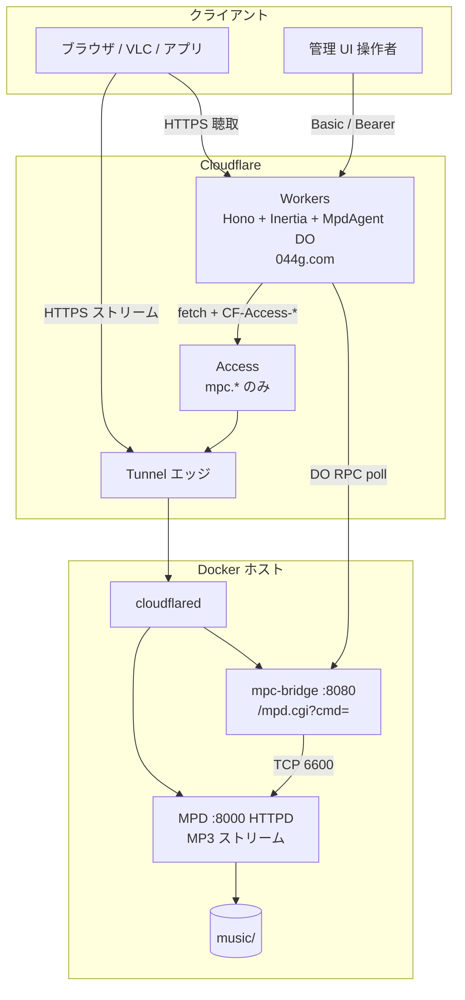
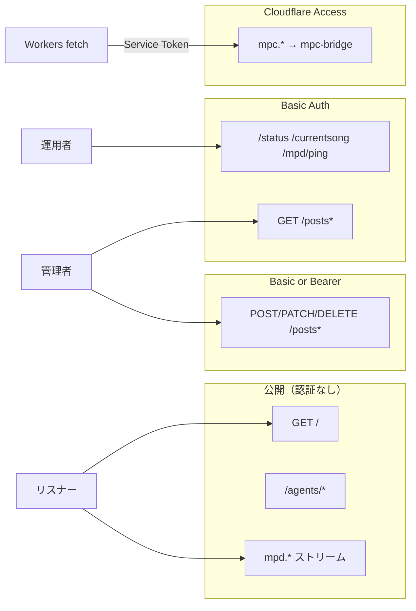
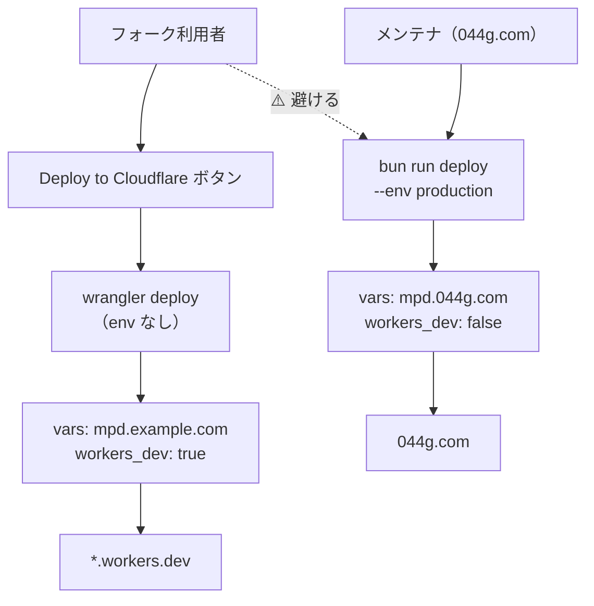
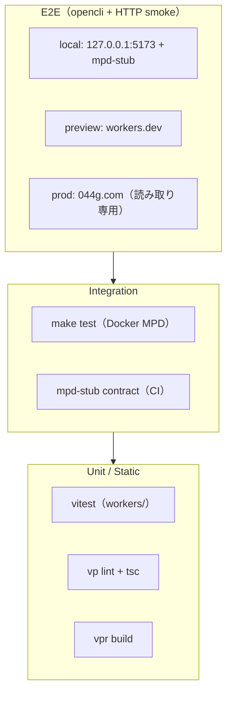
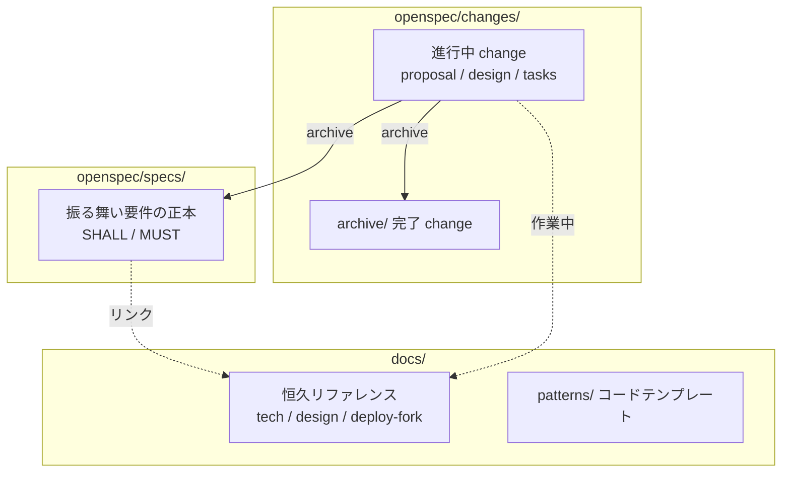
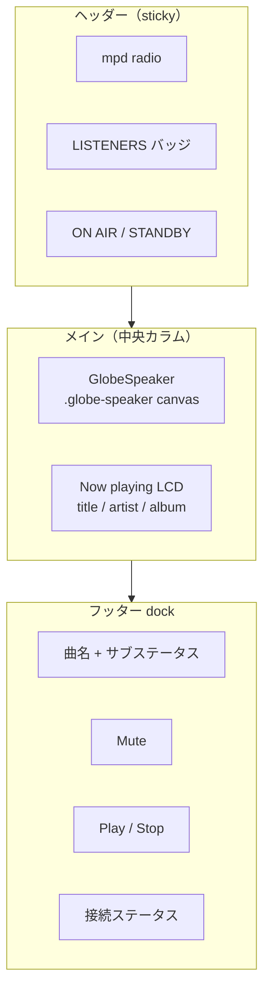
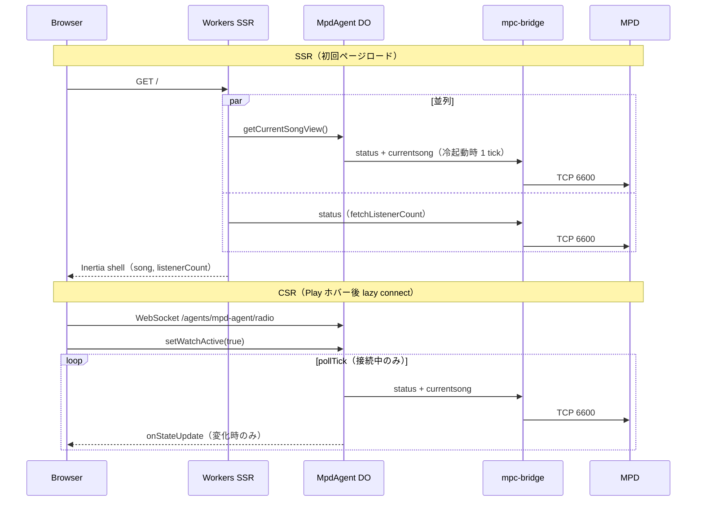

# 図解（Mermaid）

radio のアーキテクチャ・認証・デプロイ・テスト・ドキュメント階層を **1 ファイルに集約**。各 doc からはここへリンクする。

## システムトポロジ {#system-topology}



**制御の原則**: ブラウザは MPD TCP に直接触れない。ポーリングとライブ push は **MpdAgent DO 1 本**。キュー CRUD は Workers → mpc-bridge → MPD。

## 認証マトリクス {#auth-matrix}



| 経路 | 認証 | 備考 |
|------|------|------|
| `GET /`, `/agents/*` | なし | 公開ラジオ前提 |
| `mpd.*` ストリーム | なし | 聴取のみ |
| `/status`, `/currentsong`, `/mpd/ping` | Basic | ops / curl |
| `GET /posts*` | Basic | 管理 UI 閲覧 |
| `POST/PATCH/DELETE /posts*` | Basic or Bearer | キュー CRUD |
| `mpc.*` → mpc-bridge | Access Service Token | Workers のみ Allow |

## デプロイフロー（フォーク vs メンテナ） {#deploy-flow}



| コマンド | 向き先 | 利用者 |
|----------|--------|--------|
| Deploy ボタン → 既定 env | `mpd.example.com` プレースホルダ | フォーク |
| `wrangler deploy`（env なし） | 同上 | フォーク |
| `bun run deploy` | `--env production`（044g.com） | **メンテナのみ** |

詳細: [deploy-fork.md](deploy-fork.md)

## テストピラミッド {#test-pyramid}



| 層 | コマンド | 備考 |
|----|----------|------|
| Unit | `cd workers && bun run test` | serialize, parse, bridge 等 |
| Integration | `make test` | Docker MPD ヘルスチェック |
| CI | `.github/workflows/workers-ci.yaml` | unit → lint → build → mpd-stub |
| E2E local | `make test-e2e-local` | ダミー mpc-bridge 推奨 |
| E2E preview | `make test-e2e-preview` | `radio.*` または `radio-preview.*.workers.dev` |

詳細: [test.md](test.md) · preview フロー: [e2e-preview-flow](#e2e-preview-flow)

## ドキュメント三層モデル {#docs-layers}



| 層 | 正本 | 例 |
|----|------|-----|
| 振る舞い仕様 | `openspec/specs/` | `listener-home-ui/spec.md` |
| 変更計画 | `openspec/changes/<name>/` | `consolidate-docs/tasks.md` |
| 恒久ドキュメント | `docs/` | 本ファイル、`tech.md` |

詳細: [openspec.md](openspec.md)

## Home UI レイアウト {#home-ui-layout}



- スピーカー: 中央 **GlobeSpeaker**（cobe 3D 地球儀）
- 再生制御: 下部 dock（`size-12` / `size-14` = 44px+ タッチターゲット）
- 仕様: `openspec/specs/listener-home-ui/spec.md`

## MPD Home データフロー {#mpd-home-data-flow}



| 経路 | 曲メタ | リスナー数 | 備考 |
|------|--------|-----------|------|
| SSR | DO RPC（冷起動 1 tick） | bridge 直叩き | preview HTTP smoke はここ |
| CSR | DO state push | DO state push | opencli E2E はハイドレーション後 |

## E2E preview フロー {#e2e-preview-flow}

```mermaid
flowchart LR
  Deploy["bun run deploy<br/>*.workers.dev"]
  Http["http-smoke.sh"]
  Opencli["opencli-home.sh"]

  subgraph http_checks["HTTP 200 + Inertia shell"]
    H1['"component":"Home"']
    H2['"listenerCount" prop']
    H3["titleFallback"]
  end

  subgraph browser_checks["ハイドレーション後"]
    B1["LISTENERS テキスト"]
    B2[".globe-speaker"]
  end

  Deploy --> Http --> http_checks
  Http --> Opencli --> browser_checks
```

```bash
export RADIO_E2E_PREVIEW_URL=https://radio.<account>.workers.dev
make test-e2e-preview
```

詳細: [test.md](test.md)
