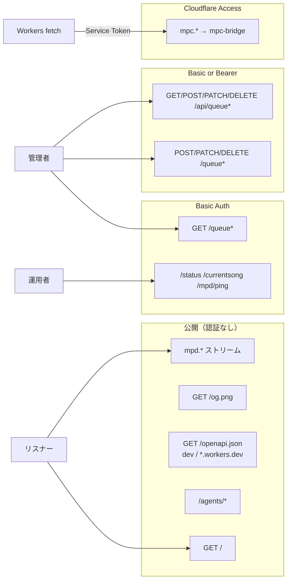

# セキュリティ仕様

> 本書は認証・認可の境界、公開面、秘密情報の責務を定義します。構成とデータフローは [architecture.md](architecture.md)、デプロイと環境ファイル運用は [maintenance.md](maintenance.md) を参照してください。

## 認証マトリクス

| 経路 | 認証 | 備考 |
|---|---|---|
| `GET /`, `/agents/*` | なし | 公開ラジオのリスナー向け面 |
| `GET /og.png` | なし | OGP 画像 |
| `GET /openapi.json` | なし（dev / `*.workers.dev`）。カスタムドメインは 404 | 公開範囲の正本は [`pattern.md`](pattern.md) |
| `mpd.*` ストリーム | なし | 聴取のみ。MPD 制御は提供しない |
| `/status`, `/currentsong`, `/mpd/ping` | Basic | ops / curl の診断面 |
| `GET /queue*` | Basic | 管理 UI 閲覧 |
| `POST/PATCH/DELETE /queue*` | Basic または Bearer | キュー CRUD |
| `GET/POST/PATCH/DELETE /api/queue*` | Basic または Bearer | JSON キュー API。閲覧も Bearer で利用可能 |
| `mpc.*` → mpc-bridge | Cloudflare Access Service Token | Workers だけが Allow される制御面 |

## 認証境界の設計意図

- `mpc.*` を Tunnel で HTTP 公開すると、認証なしでは stop / clear / playlist などの MPD 制御 API が全世界から到達可能になります。そのため Cloudflare Access の Service Auth（Service Token のみ Allow）+ Block（Everyone）を適用します。
- Workers から mpc-bridge へ fetch するときだけ `CF-Access-Client-Id` / `CF-Access-Client-Secret` ヘッダーを使います。CORS は curl やスクリプトを防ぐ認証境界ではありません。
- ストリーム（`mpd.*`）と公開 UI（`your-domain.com`）は聴取のため公開のままにし、制御面だけを閉じます。
- MPD TCP 6600 はコンテナ内ネットワークだけで到達でき、ブラウザや外部クライアントから直接接続できません。

## Worker secrets

| 名前 | 用途 |
|---|---|
| `CF_ACCESS_CLIENT_ID` / `CF_ACCESS_CLIENT_SECRET` | mpc Access Service Token |
| `USERNAME` / `PASSWORD` | 管理 UI Basic Auth |
| `TOKEN` | 管理 API Bearer（write 用 `basicOrBearer`） |

秘密情報はリポジトリへコミットせず、実行環境の secret 管理へ登録します。具体的な環境ファイル・登録手順は [maintenance.md](maintenance.md#env-files) を正本とします。
