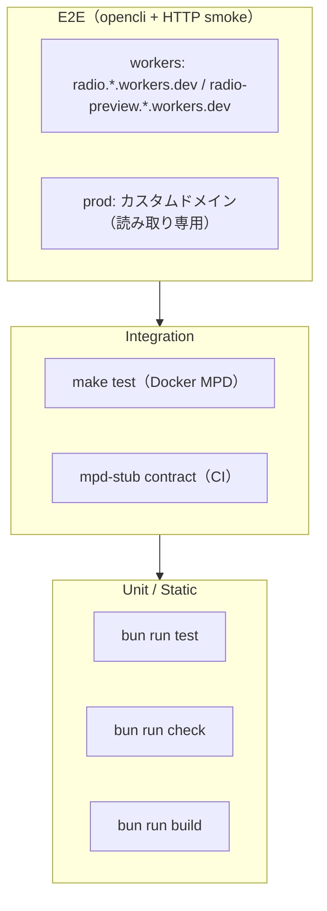
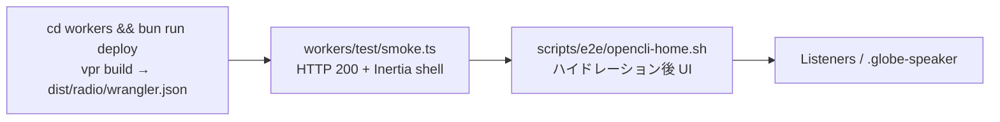

# テスト方針

<a id="test-pyramid"></a>
## テストピラミッド



| 層 | コマンド | 備考 |
|----|----------|------|
| Unit | `cd workers && bun run test` | serialize、parse、bridge 等 |
| Static | `cd workers && bun run check` | format + lint + typecheck |
| Integration | `make test` | Docker MPD ヘルスチェック |
| All local | `make test-all` | Workers unit → Docker integration |
| CI | `.github/workflows/workers-test.yaml` → `.github/workflows/workers-ci.yaml` | PR/push トリガー → unit → lint → build |
| E2E workers | `make test-e2e-workers` | `radio.*.workers.dev` / `radio-preview.*.workers.dev` |

CI は Vite+ の Vitest runner、lint、build を実行します。`tsc` 単独の CI ゲートはありません。

<a id="e2e-workers-flow"></a>
## E2E フロー（localhost なし）



`localhost:5173` / `vp dev` は **E2E に含めません**。UI の手動確認用に `bun run dev` は残しています。

### workers ティア

```bash
(cd workers && bun run deploy)
# ルート .env に RADIO_E2E_WORKERS_URL または RADIO_E2E_PREVIEW_URL を設定
make test-e2e-workers
```

`make test-e2e-workers` は `scripts/e2e/smoke-deployed.sh workers` を実行し、`workers/test/smoke.ts` の HTTP smoke を行います。`RADIO_E2E_WORKERS_URL` または `RADIO_E2E_PREVIEW_URL` を使用できます。`opencli` が利用可能な場合は `scripts/e2e/opencli-home.sh` でハイドレーション後の `Listeners` / `.globe-speaker` も確認します。`opencli` がない場合、その UI smoke はスキップされます。

fixture 値（リスナー数 3 等）は **Vite+ の Vitest 4.1.11 runner**（`bridge-current-song.test.ts`、`now-playing-display.test.ts`、`mpd-stub-http.test.ts`）で検証します（deploy 不要）。

### prod ティア

```bash
make test-e2e-prod
```

`smoke-deployed.sh prod` は `RADIO_E2E_ALLOW_PROD=1` を設定し、読み取り専用 smoke として実行します。ルート `.env` の `RADIO_E2E_PROD_URL` を自動読み込みます。

## Workers 開発コマンド

```bash
cd workers && bun run test    # ユニット
cd workers && bun run check   # format + lint + typecheck
cd workers && bun run build
```

## CI

| ワークフロー | 内容 |
|-------------|------|
| `workers-test.yaml` | PR/push トリガー。検証本体は再利用ワークフロー [`workers-ci.yaml`](../.github/workflows/workers-ci.yaml) |
| `tag.yaml` / `build.yaml` | main のタグ・リリース、GHCR イメージビルドでも `workers-ci.yaml` を利用 |

CI に opencli / workers.dev smoke は入れません（手動）。

## 環境変数

ルート [`.env.example`](../.env.example) — `RADIO_E2E_WORKERS_URL`, `RADIO_E2E_PREVIEW_URL`, `RADIO_E2E_PROD_URL`

デプロイ手順と `workers/.env` は [maintenance.md](maintenance.md) を参照してください。
